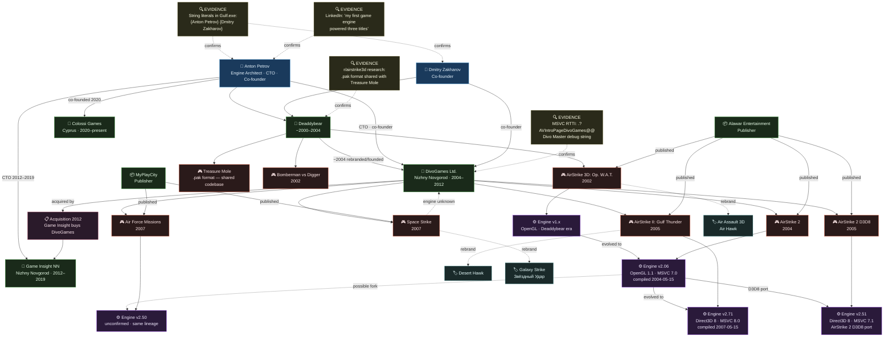

<p align="center">
  
</p>

<h1 align="center">AirStrike 3D — Reverse Engineering Toolkit</h1>

<p align="center">
  <strong>Reverse engineering the AirStrike 3D game series</strong>
</p>

<p align="center">
  <a href="https://github.com/e-gleba/airstrike3d-tools/actions/workflows/build_and_package.yml">
    
  </a>
  <a href="https://github.com/e-gleba/airstrike3d-tools/actions/workflows/publish_release.yml">
    
  </a>
  <a href="https://github.com/e-gleba/airstrike3d-tools/blob/main/license.md">
    
  </a>
  <a href="#build--development">
    
  </a>
  <a href="#engine-internals">
    
  </a>
  <a href="#toolkit">
    
  </a>
  <a href="https://github.com/e-gleba/airstrike3d-tools/issues">
    
  </a>
  <a href="https://github.com/e-gleba/airstrike3d-tools/stargazers">
    
  </a>
  <a href="https://github.com/e-gleba/airstrike3d-tools/commits/main/">
    
  </a>
</p>

<p align="center">
  <a href="https://www.pcgamingwiki.com/wiki/AirStrike_2">PCGamingWiki</a> ·
  <a href="https://en.wikipedia.org/wiki/AirStrike_3D">Original Game</a> ·
  <a href="https://www.reddit.com/r/airstrike3d/">Community (Reddit)</a>
</p>

---

## Table of Contents

- [Overview](#overview)
- [Project Status](#project-status)
- [Repository Structure](#repository-structure)
- [About the Game](#about-the-game)
  - [Developers](#developers)
  - [Deaddybear → DivoGames](#deaddybear--divogames)
  - [Franchise Timeline](#franchise-timeline)
- [Engine Internals](#engine-internals)
  - [Subsystem Naming](#subsystem-naming)
  - [Graphics API Evolution](#graphics-api-evolution)
  - [Third-Party Libraries](#third-party-libraries)
  - [Asset Formats](#asset-formats)
  - [RTTI / C++ Details](#rtti--c-details)
- [ASProtect 1.0 Analysis](#asprotect-10-analysis)
  - [Identification](#identification)
  - [How It Works](#how-it-works)
  - [v2.51 / v2.71 — No Protection](#v251--v271--no-protection)
- [Toolkit](#toolkit)
  - [APK Archive Extraction](#apk-archive-extraction)
  - [MDL ↔ OBJ Converter](#mdl--obj-converter)
  - [Save Previewer](#save-previewer)
  - [Audio Conversion](#audio-conversion)
  - [Graphics Viewing](#graphics-viewing)
  - [Linux Compatibility](#linux-compatibility)
  - [Technical Notes](#technical-notes)
- [Build & Development](#build--development)
  - [Prerequisites](#prerequisites)
  - [Quick Start](#quick-start)
  - [Building C++ Components](#building-c-components)
  - [Game Configuration](#game-configuration)
  - [Testing with CTest](#testing-with-ctest)
- [Ghidra Project](#ghidra-project)
- [Contributing](#contributing)
- [Legal Notice](#legal-notice)
- [License](#license)
- [Acknowledgments](#acknowledgments)
- [Related Resources](#related-resources)

---

## Overview

My nostalgic journey into reverse engineering AirStrike 3D — the first PC game that captured my imagination as a kid. This repository contains tools and research for understanding the game's internals.


---

## Project Status

> **Active research & tooling.**  
> This project is a living archive. Engine analysis is ongoing, new tools are added as formats are documented, and the Ghidra database is updated with fresh discoveries. Contributions from fellow reverse engineers and preservationists are welcome.

| Milestone | Status |
|-----------|--------|
| `.apk` archive format | ✅ Documented & tooling complete |
| `.mdl` model format | ✅ Bidirectional converter |
| Save file format | ✅ Decryption + preview |
| ASProtect 1.0 unpacking | ✅ Static unpacker + manual guide |
| Engine v2.06 analysis | 🔄 In progress (Ghidra) |
| Engine v2.51 analysis | 🔄 In progress (Ghidra) |
| Engine v2.71 analysis | 🔄 In progress (Ghidra) |
| v2.50 / Air Force Missions | ⏳ Pending (tracked in [#1](https://github.com/e-gleba/airstrike3d-tools/issues/1)) |

---

## Repository Structure

```
airstrike3d-tools/
├── .github/              # Branding assets & templates
├── 2_06/                 # AirStrike 2 (engine v2.06) binaries & data
├── 2_51/                 # AirStrike 2 D3D8 (engine v2.51) binaries & data
├── 2_71/                 # Gulf Thunder (engine v2.71) binaries & data
├── cmake/                # CMake modules, toolchains & code-quality configs
├── external/             # Vendored dependencies (GLAD, etc.)
├── ghidra/               # Ghidra project files for both game versions
├── scripts/              # Python tooling
│   ├── level_viewer.py
│   ├── mdl_obj_converter.py
│   ├── paktool.py
│   ├── save_editor.py
│   └── static_exe_unpacker.py
└── src/                  # C++ source code
    ├── game/             # Decompiled/reconstructed game logic (C)
    └── proxy/            # BASS proxy DLL for runtime injection & overlay
```

---

## About the Game

[AirStrike 3D](https://en.wikipedia.org/wiki/AirStrike_3D) is a helicopter shoot-em-up series developed by **[DivoGames](https://web.archive.org/web/2006/http://divogames.com/)** (Nizhny Novgorod, Russia) and published through **[Alawar Entertainment](https://en.wikipedia.org/wiki/Alawar)**. The engine and all three franchise titles were built by a two-person team.

### Developers

| Name | Role | Links |
|------|------|-------|
| **Anton Petrov** | Engine architect, CTO & co-founder | [LinkedIn](https://www.linkedin.com/in/anton-petrov-cto/) |
| **Dmitry Zakharov** | Co-founder | — |

Both names are embedded as string literals (`{Anton Petrov}`, `{Dmitry Zakharov}`) in the Gulf Thunder executable's credits data. Petrov describes the engine on LinkedIn as _"my first game engine featuring a custom scripting language and hardware-accelerated 3D graphics — powered three titles in the Air Strike 3D franchise"_.

After DivoGames, Petrov became CTO at **Game Insight** (2012–2019, Nizhny Novgorod department), then co-founded **Colossi Games** in Cyprus (2020–present).

### Deaddybear → DivoGames

Before DivoGames was officially founded (~2004), the initial AirStrike chapters were developed under a group called **Deaddybear**. Community [research on r/airstrike3d](https://www.reddit.com/r/airstrike3d/comments/16k254c/about_divogames_earlier_development_projects/) found that Deaddybear's earlier game _Treasure Mole_ used a nearly identical `.pak` archive format — confirming shared codebase ancestry. Deaddybear also released _Bomberman vs Digger_ (2002).

### Franchise Timeline

| Year | Title | Publisher | Genre | Engine | Known Alias |
|------|-------|-----------|-------|--------|-------------|
| 2002 | AirStrike 3D: Operation W.A.T. | Alawar | Helicopter shooter | v1.x (OpenGL, Deaddybear era) | *Air Assault 3D*, *Air Hawk* |
| 2004 | AirStrike 2 | Alawar / self | Helicopter shooter | v2.06 (OpenGL 1.1, MSVC 7.0) | *АвиаНалет 2* (ru) |
| 2005 | AirStrike 2 D3D8 | Alawar / self | Helicopter shooter | v2.51 (Direct3D 8, MSVC 7.1) | — |
| 2005 | AirStrike II: Gulf Thunder | Alawar | Helicopter shooter | v2.71 (Direct3D 8, MSVC 8.0) | *Desert Hawk* |
| 2007 | Air Force Missions | MyPlayCity | Helicopter shooter | v2.50 (unconfirmed, same engine lineage) | — |
| 2007 | Space Strike | MyPlayCity | Space shooter | unknown | *Galaxy Strike*, *Звёздный Удар* |

> **Known retail rebrands** (same binary, different publisher skin):
> - *AirStrike 3D: Operation W.A.T.* → **"Air Assault 3D"** / **"Air Hawk"**
> - *AirStrike II: Gulf Thunder* → **"Desert Hawk"**
> - *Space Strike* → **"Galaxy Strike"**
>
> **AirStrike 2 D3D8** (v2.51) is the Direct3D 8 port of AirStrike 2 — same game, updated graphics backend. Not to be confused with Gulf Thunder (v2.71), which is a distinct title with new content.
>
> **Air Force Missions** and **Space Strike** are distinct DivoGames titles — separate from the Alawar-published trilogy — released in 2007 under a MyPlayCity distribution deal. Air Force Missions is a helicopter shooter sharing visible engine DNA with Operation W.A.T. (version string `2.50` observed in binary); Space Strike is a space shooter, unrelated gameplay-wise. Neither title's asset format compatibility with v2.06/v2.71 tooling has been confirmed — requires binary diff. Issue tracked at [#1](https://github.com/e-gleba/airstrike3d-tools/issues/1).
>
> DivoGames was acquired by **Game Insight** in 2012; both 2007 titles are now part of that catalog.



---

## Engine Internals

Custom C++ engine with no third-party framework. Uses Quake-style subsystem prefixes:

### Subsystem Naming

| Subsystem | Prefix | Examples |
|-----------|--------|----------|
| Game logic | `G_` | `G_LoadBin`, `G_LoadLevelList` |
| Renderer | `R_` | `R_LoadModel`, `R_RegisterModel`, `R_RegisterShadow` |
| Sound | `S_` | `S_Init`, `S_RegisterSound` |
| Window | `MW_` | `MW_CreateWindow` |

### Graphics API Evolution

| Version | API | Compiler | Compile timestamp | Rich header |
|---------|-----|----------|-------------------|-------------|
| v2.06 (`as3d2.exe`) | OpenGL 1.1 (`opengl32.dll`, `glu32.dll`) | MSVC 7.0 (.NET 2002/2003) | `2004-05-15 10:12:58 UTC` | ✅ |
| v2.51 (`as3d2.exe`) | Direct3D 8 (`d3d8.dll`) | MSVC 7.1 (.NET 2003) | — | ✅ |
| v2.71 (`Gulf.exe`) | Direct3D 8 (`d3d8.dll`) | MSVC 8.0 (VS2005) | `2007-05-15 13:49:28 UTC` | ✅ |

### Third-Party Libraries

- **[BASS](https://www.un4seen.com/)** — Audio library. 3D positional audio, EAX effects, MO3/tracker module playback.
- **libjpeg** — `Copyright (C) 1996, Thomas G. Lane` (found in Gulf exe strings).
- **zlib + libpng** — PNG texture support.
- **Custom scripting language** — Confirmed by Petrov on LinkedIn, no public documentation survived.

### Asset Formats

| Format | Extension | Description |
|--------|-----------|-------------|
| Archives | `.apk` | Custom encrypted containers (XOR, 1024-byte key table). **Not** Android APK. |
| Models | `.mdl` | Custom 3D format with version checks (`R_LoadModel: Illegal model version.`) |
| Textures | `.tga` | Standard Targa. Organized in `gfx/`, `menu/`, `tiles/` dirs. |
| Levels | `maps/levels.txt` | Plaintext level list (encrypted inside `.apk`) |
| Audio | `.mo3` | Tracker modules via BASS library |
| Config | `config.ini` | Plaintext, stored alongside the executable |

### RTTI / C++ Details

MSVC RTTI type descriptors found in the Gulf binary (e.g. `.?AVIntroPageDivoGames@@`), confirming C++ with virtual inheritance and RTTI enabled. `Divo Master` string suggests an internal tool or debug mode.

---

## ASProtect 1.0 Analysis

The v2.06 executable (`as3d2.exe`, 199,680 bytes) is packed with **[ASProtect 1.0](http://asprotect.net)** by Alexey Solodovnikov.

### Identification

| Indicator | Value | Meaning |
|-----------|-------|---------|
| Entry point | `.data` section (`0x1DB3001`) | Packer stub, not original code |
| EP signature | `60 E8 01 00 00 00` | `PUSHAD` + `CALL +1` — textbook ASProtect 1.0 |
| Section flags | All `0xC0000040` (RWX) | Packer rewrites all section attributes |
| `.text` entropy | **8.00** (maximum) | Fully encrypted/compressed |
| Visible IAT | 3 imports: `GetProcAddress`, `GetModuleHandleA`, `LoadLibraryA` | Real IAT resolved at runtime |
| Compression | aPLib (LZ77 variant) | See [`scripts/static_exe_unpacker.py`](scripts/static_exe_unpacker.py) |
| Hashes | `MD5: 1ba6f0187c43d07587e5212f1cb14190` | `SHA256: bc68bf37...81fb1a` |

### How It Works

1. **Section wiping** — Original section names erased, all flags set to `0xC0000040`. Two `.data` stubs appended.
2. **aPLib decompression** — Compressed `.text` stored in oversized `.data` (VirtSize 30 MB, RawSize 4 KB).
3. **OEP byte stealing** — First bytes of Original Entry Point executed inside the stub before jumping to `OEP+N`.
4. **IAT redirection** — Import calls routed through ASProtect memory; executes first instructions of real API in-place, then jumps mid-body.
5. **Anti-debug** — `IsDebuggerPresent()`, RDTSC timing, SEH breakpoint detection, debugger driver `CreateFile()` probes.
6. **Checksums** — Code integrity verification to detect runtime patching.
7. **Anti-disasm** — Junk bytes after `CALL` instructions break linear-sweep disassemblers (W32DASM, SOURCER); IDA handles fine.

### v2.51 / v2.71 — No Protection

Both v2.51 and v2.71 ship **completely unprotected** — no ASProtect, no packing, no anti-debug tricks:

| Version | EP location | Entropy | IAT | Strings |
|---------|-------------|---------|-----|---------|
| v2.51 (`as3d2.exe`) | `.text` | normal | Full | Readable |
| v2.71 (`Gulf.exe`) | `.text` | 6.83 | Full | Developer credits, error strings plainly readable |

Much better targets for engine analysis compared to the ASProtect-wrapped v2.06.

---

## Toolkit

### APK Archive Extraction

```bash
# Extract game assets from encrypted .apk archives
python scripts/paktool.py extract pak0.apk          # Extract all files
python scripts/paktool.py pack extracted_dir/ new.apk  # Repack modified assets
```

### MDL ↔ OBJ Converter

```bash
python scripts/mdl_obj_converter.py some_file.mdl
python scripts/mdl_obj_converter.py some_file.obj
```

### Save Previewer

```bash
python scripts/save_editor.py decrypt game.bin -o decrypted.bin
```

### Audio Conversion

```bash
# Convert MO3 tracker modules to standard audio
sudo dnf install libopenmpt openmpt123
openmpt123 --render file.mo3 --output file.wav
```

### Graphics Viewing

```bash
# Best TGA texture viewer for Linux
# https://github.com/bluescan/tacentview
tacentview texture.tga
```

### Linux Compatibility

#### Running via Steam Proton (Fedora + AMD GPU)

```bash
# Fix OpenGL extension issues for old games
MESA_EXTENSION_MAX_YEAR=2003 %command%
```

Add this to the game's launch options in Steam.

### Technical Notes

- **Archive Format:** Custom encrypted APK containers (not Android APK)
- **Executable:** ASProtect v1.0 packed (detected via YARA rules)
- **Assets:** TGA textures, MDL 3D models, MO3 audio modules
- **Encryption:** XOR cipher with 1024-byte key table

---

## Build & Development

### Prerequisites

- **CMake** 3.31 or newer
- **Python** 3.13
- **Ninja** (used by non-MSVC presets)
- **Clang** (for native Windows builds) or **LLVM-MinGW** (for Linux → Windows cross-compilation)
- **Visual Studio 2022** (optional, for local MSVC builds)

### Quick Start

1. Clone this repository
2. Extract game assets: `python scripts/paktool.py extract /path/to/pak0.apk`
3. Browse extracted files in the created directory
4. Convert audio files as needed

### Building C++ Components

#### Linux → Windows (cross-compile via LLVM-MinGW)

1. Download **llvm-mingw** from [mstorsjo/llvm-mingw releases](https://github.com/mstorsjo/llvm-mingw/releases):
   - `llvm-mingw-YYYYMMDD-ucrt-ubuntu-20.04-x86_64.tar.xz` for Windows 10+ (UCRT)
   - `llvm-mingw-YYYYMMDD-msvcrt-ubuntu-20.04-x86_64.tar.xz` for Windows 7+ (legacy CRT)

2. Extract to repository root in directory `llvm-mingw`

3. Run:

```bash
cmake --preset llvm-mingw-i686
cmake --workflow --preset llvm-mingw-i686-release
```

> **Note:** The preset uses `jobs=1` due to an LLD linker deadlock on parallel linking in the MinGW context.

#### Windows (native Clang)

```bash
cmake --preset clang_windows_x86
cmake --workflow --preset clang_windows_x86-release
```

Uses pure **Clang** (`clang`/`clang++` GNU driver) targeting 32-bit Windows with the **Ninja Multi-Config** generator. This is the recommended fast path for CI and local Windows builds.

#### Windows (optional, Visual Studio 2022)

```bash
cmake --preset msvc
cmake --workflow --preset msvc-release
```

Available for local development when Visual Studio 2022 is preferred. Not used in CI.

### Game Configuration

The build system automatically generates `config.ini` for each game version during deployment. This ensures the game starts directly with sensible defaults instead of showing the launcher configuration window.

#### Default Settings

Generated from [`cmake/config.ini.in`](cmake/config.ini.in) template:

| Setting | Value | Purpose |
|---------|-------|---------|
| `VideoMode` | 5 (1600×1200) | Modern resolution for better image quality |
| `Fullscreen` | 1 | Immersive gameplay |
| `WaitVSync` | 0 | Reduces input lag |
| `ShowFPS` | 1 | Debug overlay for performance monitoring |
| `SfxVolume` | 0.5 | Balanced sound effects (50%) |
| `MusicVolume` | 0.5 | Balanced music (50%) |
| `FirstRun` | 0 | Skips initial setup dialogs |

#### Customizing Configuration

To modify defaults for all versions, edit `cmake/config.ini.in`:

```ini
[Display]
VideoMode=6          # Change to 1920×1080 or higher
Fullscreen=0         # Windowed mode for debugging
WaitVSync=1          # Enable VSync to reduce tearing
```

To customize per-version, create version-specific overrides in `2_XX/config.ini.in` (not yet implemented — all versions currently share the same template).

#### Why Auto-Generate?

The original games shipped without `config.ini` and required users to configure settings via a launcher dialog on first run. This automated approach:

- **Eliminates manual setup** — games start immediately with tested defaults
- **Ensures consistency** — same configuration across all three versions
- **Supports automation** — CTest can launch games without human intervention
- **Preserves defaults** — template tracks optimal settings for modern systems

### Testing with CTest

The project includes comprehensive CTest integration for validating the Proton launcher emulator across all three game versions (2_06, 2_51, 2_71). Tests are organized in three tiers with increasing scope and execution time.

#### Test Tiers

| Tier | Purpose | Platform | Typical Duration |
|------|---------|----------|------------------|
| **deploy** | Verify deployment artifacts (exe, dll, data, config.ini) staged correctly | Any | <1s |
| **proton** | Detect Proton + Steam Linux Runtime availability | Linux only | <2s |
| **launch** | Smoke-test emulator boot (banner detection) | Linux + Proton | 5–30s |

All tests use **CTest fixtures** to ensure deployment completes before validation runs. Non-Linux hosts automatically skip integration tiers via `SKIP_REGULAR_EXPRESSION` matching the `PROTON_SKIP` sentinel.

#### Running Tests

**Quick validation (deployment only, cross-platform):**

```bash
# After configure + build
ctest --test-dir build/llvm-mingw-i686 --label-regex deploy --output-on-failure
```

**Full emulator validation (Linux with Proton installed):**

```bash
# Run all tests for a specific version
ctest --test-dir build/llvm-mingw-i686 -R "2_71" --output-on-failure

# Run only launch tests (slowest tier)
ctest --test-dir build/llvm-mingw-i686 --label-regex launch --output-on-failure

# Run all tests across all versions
ctest --test-dir build/llvm-mingw-i686 --output-on-failure --parallel
```

**Using presets (recommended for local testing):**

```bash
# Workflow preset WITH tests (requires Steam + Proton installed)
cmake --workflow --preset llvm-mingw-i686-release-with-tests

# Or run test preset directly after configure + build
ctest --preset llvm-mingw-i686-test-release
```

> **Note:** Standard CI workflow presets (`llvm-mingw-i686-release`, `clang_windows_x86-release`, `msvc-release`) do NOT include tests to avoid requiring Steam/Proton on CI runners. Use the `-with-tests` variants for local development or dedicated test environments.

#### Configuration

**Cache variables:**

| Variable | Default | Description |
|----------|---------|-------------|
| `AS3D_ENABLE_TESTS` | `ON` | Build and register CTest emulator tests |
| `AS3D_EMULATOR_TEST_TIMEOUT` | `5` | Timeout (seconds) for smoke-launch tests |

Adjust timeout for slow CI runners or fast local iteration:

```bash
# Increase timeout for CI
cmake --preset llvm-mingw-i686 -DAS3D_EMULATOR_TEST_TIMEOUT=15

# Disable tests entirely (faster configure)
cmake --preset llvm-mingw-i686 -DAS3D_ENABLE_TESTS=OFF
```

#### Development Workflow

**Iterating on deployment logic:**

```bash
# 1. Modify deploy_game.cmake or version CMakeLists.txt
# 2. Reconfigure (CTest picks up changes automatically)
cmake --preset llvm-mingw-i686

# 3. Run only deploy-tier tests (fast feedback)
ctest --test-dir build/llvm-mingw-i686 --label-regex "deploy;fixture" --output-on-failure

# 4. When deploy passes, run full suite
ctest --test-dir build/llvm-mingw-i686 --output-on-failure
```

**Debugging a failing test:**

```bash
# Verbose output + stop on first failure
ctest --test-dir build/llvm-mingw-i686 -R "emulator_launch_2_71" --verbose --stop-on-failure

# Inspect deployment directory manually
ls -la build/llvm-mingw-i686/2_71/

# Run emulator directly (bypass CTest)
./build/llvm-mingw-i686/2_71/run_game.sh --debug
```

**Adding new test cases:**

Tests are registered per-version in `cmake/proton_testing.cmake::add_proton_emulator_tests()`. To add a new test tier:

1. Create `cmake/check_<new_tier>.cmake` (follow `check_launch.cmake` pattern)
2. Add `add_test()` call in `add_proton_emulator_tests()`
3. Set `LABELS`, `FIXTURES_REQUIRED`, `TIMEOUT`, `SKIP_REGULAR_EXPRESSION` as needed
4. Update this README table with new tier

#### Test Output

CTest prints short progress by default. For detailed diagnostics:

```bash
# Full output (stdout + stderr from each test)
ctest --test-dir build/llvm-mingw-i686 --output-on-failure --verbose

# JSON output (for CI parsing)
ctest --test-dir build/llvm-mingw-i686 --output-junit test-results.xml
```

#### Troubleshooting

| Symptom | Cause | Fix |
|---------|-------|-----|
| `PROTON_SKIP` on Linux | Steam not found or Proton not installed | Install Steam + Proton, verify `~/.steam/steam/steamapps/common/Proton*` exists |
| `deploy_fixture_*` fails | Build incomplete or missing game binaries | Run `cmake --build build --target deploy_game_<version>` first |
| `emulator_launch_*` timeout | Proton slow to initialize or game hangs | Increase `AS3D_EMULATOR_TEST_TIMEOUT` or check `logs/*.log` in deploy dir |
| All tests pass but game doesn't run | Proton prefix corrupted | Delete `~/.proton_prefixes/<exe>/` and retry |

---

## Ghidra Project

🔒 Since the v2.06 executable is protected with **ASProtect 1.0**, I opted for a straightforward approach on Linux: attach a simple debugger and single-step until the unpacking loop surfaces. The game unpacks itself in-place, spawning threads along the way — at some point the debugger detaches into `ntdll` magic 🪄. The trick is to pause at any moment and grab the address of the function you're interested in (e.g., the main loop).

🎯 The next step is using **x64dbg** with the **DumpEx** plugin — dump at the address of the main loop function. And that's all!

📊 **Stats:**

- 📦 Game size: **31.2 MB**
- 🔍 In the Ghidra project I have marked some of the interesting places:
  - 🎮 Loading models
  - 💾 Working with saves
  - 🔧 Core game mechanics

🚀 **Usage:**

> Just clone and open with Ghidra — the project is ready to explore yourself!

Maybe some time someone will reverse it completely 😏 🦀⚡

---

## Contributing

We welcome contributions from reverse engineers, preservationists, and enthusiasts. Please see [`.github/contributing.md`](.github/contributing.md) for guidelines on coding standards, commit conventions, and the pull request workflow.

---

## Legal Notice

**Educational and preservation purposes only. Respect original copyrights.**

This project is intended for research, education, and game preservation. All game binaries, assets, and trademarks are property of their respective owners (DivoGames / Game Insight / Alawar Entertainment / MyPlayCity). Do not use these tools to circumvent copy protection for commercial gain or to distribute copyrighted material without authorization.

---

## License

This repository is licensed under the [MIT License](license.md).

> *Because knowledge should be free, just like the joy of playing games.*

---

## Acknowledgments

To that old PC that could barely run the game but somehow made it magical anyway.

---

## Related Resources

- [r/airstrike3d](https://www.reddit.com/r/airstrike3d/) — community research & modding
- [Ithamar's APK scripts](https://gist.github.com/Ithamar/85f1f71d179c354fad483a8c48767daf) — updated extraction with text decryption
- [QindieGL](https://github.com/nicedrak/QindieGL) — OpenGL-to-D3D wrapper for running on modern Windows
- [PCGamingWiki: AirStrike 2](https://www.pcgamingwiki.com/wiki/AirStrike_2) — compatibility fixes
- [xakep.ru: ASProtect taming](https://xakep.ru/2003/07/10/19112/) — technical packer analysis (Russian)
- [ASProtect homepage](http://asprotect.net) — Alexey Solodovnikov's official site
